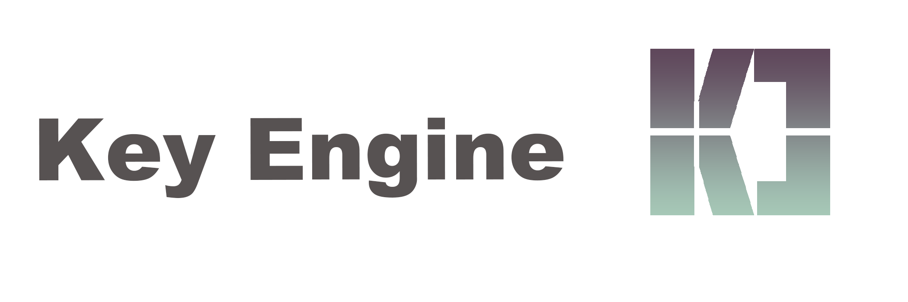
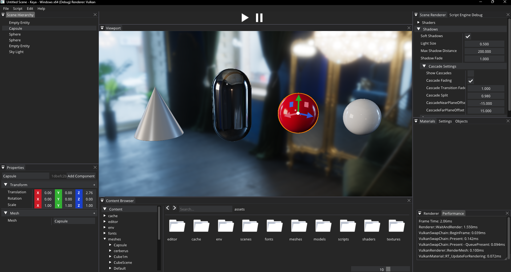
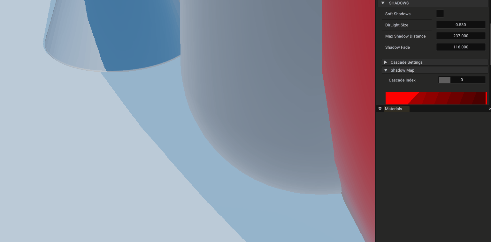
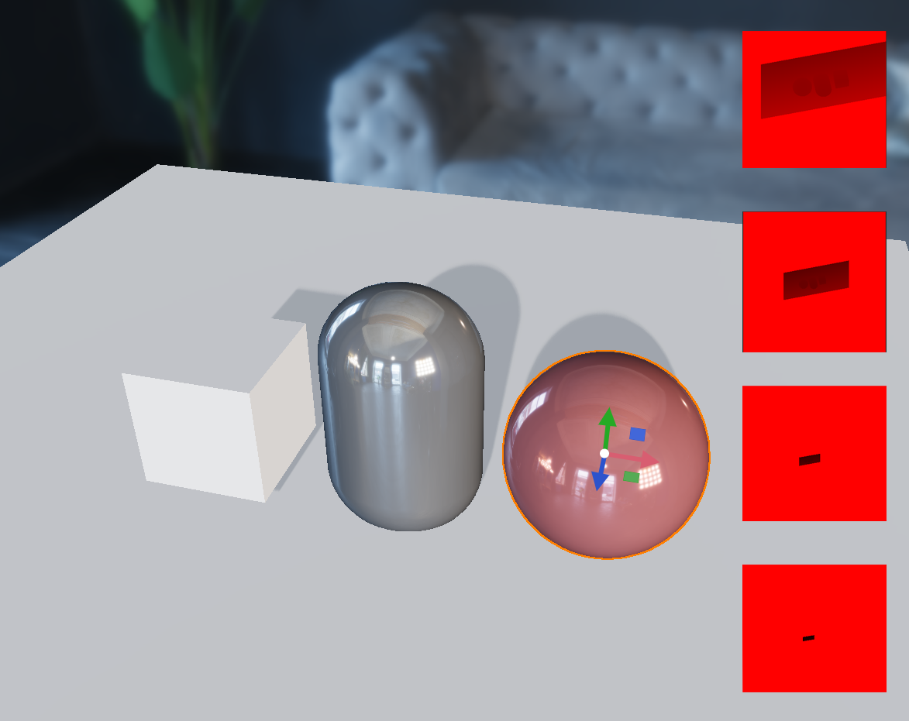

# KeyEngine
Key Engine 是一款个人游戏引擎。我使用它作为学习实时渲染和引擎技术的平台。

See [build.md](build.md)

# 特性

- 支持Vulkan和OpenGL的渲染后端
- 着色器编译和材质系统
- 资源管理器，适用于纹理、网格、着色器、材质文件等
- 带有序列化的场景编辑器
- 编辑器工具（变换小工具、属性编辑器等）
- 基本的性能捕获/检查工具
- 渲染功能：
  - 平行光、点光源、spot光源
  - 基于物理的着色模型(PBR)
  - 基于图像的环境光照(IBL)
  - 层级阴影映射
  - PCSS软阴影
  - MSAA
- 支持Windows操作系统
 

# 截图
- **引擎界面**
  
- **模型PBR渲染、IBL环境光**

- **软阴影**

- **层级阴影映射**
  

# 依赖

Key Engine 使用了以下开源库：

- [glfw](https://github.com/glfw/glfw) - 窗口创建，输入处理
- [glm](https://github.com/g-truc/glm) - 数学运算
- [ImGui](https://github.com/ocornut/imgui) - 用户界面
- [stb](https://github.com/nothings/stb) - 图像加载
- [assimp](https://github.com/assimp/assimp) - 模型加载
- [spdlog](https://github.com/gabime/spdlog.git) - 日志系统

# 致谢

向以下个人和组织表示巨大的感谢，感谢他们提供的非常有用的资源：

- Baldur Karlsson of [github.com/baldurk/renderdoc](https://github.com/baldurk/renderdoc)
- Alexander Overvoorde of [vulkan-tutorial.com](https://vulkan-tutorial.com)
- Sascha Willems of [github.com/SaschaWillems/Vulkan](https://github.com/SaschaWillems/Vulkan)
- Joey de Vries of [learnopengl.com](https://learnopengl.com)
- Andrew Maximov 提供的手枪模型和纹理 [artisaverb.info/PBT.html](http://artisaverb.info/PBT.html)
- [FreePBR.com](https://FreePBR.com) 提供的高质量PBR纹理
- The Cherno [https://github.com/TheCherno/Hazel](https://github.com/TheCherno/Hazel) 提供的高质量的引擎教程
- 以上提到的所有开源库的作者和贡献者